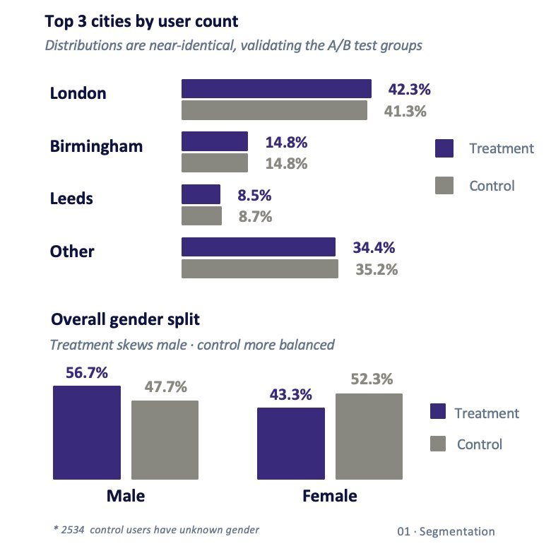
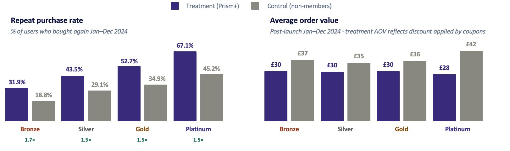

# Prism+ Loyalty Scheme — Strategic Review

## Introduction

Prism+ is a loyalty programme offered by Prism, a simulated e-commerce company. Launched on 1 January 2024, the scheme was designed with three goals in mind: increasing revenue by motivating customers to spend more to reach the next tier, improving customer loyalty through tiered discounts and free shipping, and driving word-of-mouth growth through a personalised referral code system.

This project analyses the results of a live A/B test run throughout 2024, comparing enrolled Prism+ members against a matched control group of eligible non-members. The analysis produces four data-grounded recommendations for the future of the scheme, along with a full financial impact assessment.

SQL Queries: [SQL Folder](/SQL/)

## Tools I Used

| Tool | Purpose |
|---|---|
| Google BigQuery | Data warehousing and SQL querying |
| SQL | All data extraction, transformation, and analysis |
| PowerPoint | Presentation of findings to stakeholders |


## Scheme Design

Prism+ operates a four-tier progressive rewards structure. Tier assignment was based on the number of purchases made in the two years prior to launch (January 2022 – December 2023):

| Tier | Purchases Required | Discount | Free Shipping |
|---|---|---|---|
| Bronze | 1 | 5% | ✓ | 
| Silver | 2 | 10% | ✓ |
| Gold | 3 | 15% | ✓ |
| Platinum | 4+ | 20% | ✓ | 

Each member received a personalised referral code in the format `PRSMFRND-{user_crm_id}`, designed to encourage existing members to bring in new customers organically. Free shipping was applied across all tiers.

### Original scheme rationale
The scheme was built on three intended benefits:
- **Increased revenue** — tiered discounts motivate customers to spend more to reach the next tier, with the 20% Platinum discount designed to encourage repeat purchases
- **Improved customer loyalty** — free shipping across all tiers and continuous discount value keeps customers engaged
- **Word of mouth** — the PRSMFRND referral code encourages existing customers to expand the customer base organically


## Data

- **Platform:** Google BigQuery
- **Database:** `prism-insights.warehouse`
- **Tables:** `warehouse.users`, `warehouse.transactions`
- **Date range:** 1 January 2022 - 31 December 2024 
- **Pilot launch:** 1 January 2024
- **Tier assignment window:** 1 January 2022 – 31 December 2023
- **Analysis date range:** 1 January 2024 - 31 December 2024 (post-pilot)

### Users table
`user_crm_id`, `city`, `user_gender`, `registration_date`, `latest_login_date`, `first_purchase_date`, `latest_purchase_date`, `opt_in_status`, `transaction_count`, `total_revenue`, `prism_plus_status`, `prism_plus_tier`

### Transactions table
`date`, `user_cookie_id`, `user_crm_id`, `session_id`, `transaction_id`, `transaction_coupon`, `transaction_revenue`, `transaction_shipping`, `transaction_total`


## A/B Test Methodology

### Eligibility criteria
Users were eligible for the A/B test if they:
- Registered before 2024
- Opted in to email marketing
- Made at least 1 purchase between January 2022 and December 2023

### Group assignment
- **Treatment group:** enrolled Prism+ members, assigned to a tier based on their 2022–2023 purchase history
- **Control group:** eligible non-members who met all criteria but were not enrolled

Groups were balanced at 11,319 users each, with equal numbers per tier. `ORDER BY user_crm_id` was used (not `RAND()`) to ensure consistent, reproducible group assignment across every query run.

### Query 1 — Initial user count per tier (before balancing)

This query establishes the raw eligible population for the A/B test — all users who registered before 2024, opted in to email marketing, and made at least one purchase in the 2022–2023 window. It assigns control tier labels based on transaction count and counts users per tier before balancing.

```sql
-- 1. User count for treatment and control group within each tier

WITH prism_plus_experiment_user_setup AS
(SELECT
   u.user_crm_id,
   u.city,
   u.user_gender,
   u.registration_date,
   u.latest_login_date,
   u.first_purchase_date,
   u.latest_purchase_date,
   u.opt_in_status,
   u.transaction_count,
   u.total_revenue,
   u.prism_plus_status,


   # Where prism_plus_status is not true, assign control tier based on transaction_count
   CASE
       WHEN u.prism_plus_status IS TRUE THEN u.prism_plus_tier
       WHEN COALESCE(t.transaction_count_past_2_years, 0) = 1  THEN 'bronze_control'
       WHEN COALESCE(t.transaction_count_past_2_years, 0) = 2  THEN 'silver_control'
       WHEN COALESCE(t.transaction_count_past_2_years, 0) = 3  THEN 'gold_control'
       WHEN COALESCE(t.transaction_count_past_2_years, 0) >= 4 THEN 'platinum_control'
   END AS prism_plus_tier,


   # Count of transactions in the last two years per user
   COALESCE(t.transaction_count_past_2_years, 0) AS transaction_count_past_2_years


FROM prism-insights.warehouse.users AS u
LEFT JOIN (
   SELECT
       user_crm_id,
       COUNT(DISTINCT transaction_id) AS transaction_count_past_2_years
   FROM prism-insights.warehouse.transactions
   WHERE date BETWEEN '2022-01-01' AND '2023-12-31'
   GROUP BY user_crm_id
) AS t
   ON u.user_crm_id = t.user_crm_id
WHERE registration_date < '2024-01-01'AND opt_in_status = TRUE AND t.transaction_count_past_2_years > 0)


SELECT prism_plus_tier, COUNT(*) as count_users
FROM prism_plus_experiment_user_setup
GROUP BY prism_plus_tier
ORDER BY count_users
```
**Result:**

| Tier | Count |
|---|---|
| bronze_control | 7,980 |
| Bronze | 7,512 |
| silver_control | 2,192 |
| Silver | 2,307 |
| gold_control | 797 |
| Gold | 874 |
| platinum_control | 818 |
| Platinum | 1,012 |


**Tier naming convention:**

- Treatment: `Bronze`, `Silver`, `Gold`, `Platinum`
- Control: `bronze_control`, `silver_control`, `gold_control`, `platinum_control`

This shows that treatment exceeds control for Silver, Gold, and Platinum tiers. Bronze is the exception — control (7,980) is larger than treatment (7,512). Groups are therefore downsampled to the smaller of the two per tier using `LEAST(treatment_n, control_n)` in Query 2, resulting in the balanced 11,319 / 11,319 split.


### Query 2 — Balanced group sizes (treatment and control matched per tier)

Because some tiers had more treatment than control users (or vice versa), groups are downsampled to the smaller of the two using `LEAST(treatment_n, control_n)`. Users are selected by `ORDER BY user_crm_id` to ensure reproducibility.

```sql
-- 2. Make the treatment vs control numbers in each tier equal (treatment and control ordered by user id)

WITH prism_plus_experiment_user_setup AS (
  SELECT
    u.user_crm_id,
    u.city,
    u.user_gender,
    u.registration_date,
    u.latest_login_date,
    u.first_purchase_date,
    u.latest_purchase_date,
    u.opt_in_status,
    u.transaction_count,
    u.total_revenue,
    u.prism_plus_status,
    CASE
      WHEN u.prism_plus_status IS TRUE THEN u.prism_plus_tier
      WHEN COALESCE(t.transaction_count_past_2_years, 0) = 1  THEN 'bronze_control'
      WHEN COALESCE(t.transaction_count_past_2_years, 0) = 2  THEN 'silver_control'
      WHEN COALESCE(t.transaction_count_past_2_years, 0) = 3  THEN 'gold_control'
      WHEN COALESCE(t.transaction_count_past_2_years, 0) >= 4 THEN 'platinum_control'
    END                                                         AS prism_plus_tier,
    COALESCE(t.transaction_count_past_2_years, 0)               AS transaction_count_past_2_years
  FROM `prism-insights.warehouse.users` AS u
  LEFT JOIN (
    SELECT
      user_crm_id,
      COUNT(DISTINCT transaction_id)                            AS transaction_count_past_2_years
    FROM `prism-insights.warehouse.transactions`
    WHERE date BETWEEN '2022-01-01' AND '2023-12-31'
    GROUP BY user_crm_id
  ) AS t
    ON u.user_crm_id = t.user_crm_id
  WHERE u.registration_date < '2024-01-01'
    AND u.opt_in_status = TRUE
    AND t.transaction_count_past_2_years > 0
),
treatment AS (
  SELECT * FROM prism_plus_experiment_user_setup
  WHERE prism_plus_status IS TRUE
),
control AS (
  SELECT * FROM prism_plus_experiment_user_setup
  WHERE prism_plus_status IS FALSE
),
treatment_counts AS (
  SELECT prism_plus_tier, COUNT(*) AS n
  FROM treatment
  GROUP BY prism_plus_tier
),
tier_mapping AS (
  SELECT 'bronze_control'   AS control_tier, 'Bronze'   AS treatment_tier UNION ALL
  SELECT 'silver_control'   AS control_tier, 'Silver'   AS treatment_tier UNION ALL
  SELECT 'gold_control'     AS control_tier, 'Gold'     AS treatment_tier UNION ALL
  SELECT 'platinum_control' AS control_tier, 'Platinum' AS treatment_tier
),
control_counts AS (
  SELECT tm.treatment_tier AS prism_plus_tier, COUNT(*) AS n
  FROM control c
  JOIN tier_mapping tm ON c.prism_plus_tier = tm.control_tier
  GROUP BY 1
),
target_counts AS (
  SELECT
    t.prism_plus_tier,
    LEAST(t.n, c.n)                                             AS target_n
  FROM treatment_counts t
  JOIN control_counts c ON t.prism_plus_tier = c.prism_plus_tier
),
treatment_ranked AS (
  SELECT
    *,
    ROW_NUMBER() OVER (
      PARTITION BY prism_plus_tier
      ORDER BY user_crm_id
    )                                                           AS rn
  FROM treatment
),
control_ranked AS (
  SELECT
    c.*,
    tm.treatment_tier                                           AS treatment_tier_key,
    ROW_NUMBER() OVER (
      PARTITION BY c.prism_plus_tier
      ORDER BY c.user_crm_id
    )                                                           AS rn
  FROM control c
  JOIN tier_mapping tm ON c.prism_plus_tier = tm.control_tier
),
balanced_treatment AS (
  SELECT
    tr.user_crm_id, tr.city, tr.user_gender, tr.registration_date,
    tr.latest_login_date, tr.first_purchase_date, tr.latest_purchase_date,
    tr.opt_in_status, tr.transaction_count, tr.total_revenue,
    tr.prism_plus_status, tr.prism_plus_tier, tr.transaction_count_past_2_years
  FROM treatment_ranked tr
  JOIN target_counts tc ON tr.prism_plus_tier = tc.prism_plus_tier
  WHERE tr.rn <= tc.target_n
),
balanced_control AS (
  SELECT
    cr.user_crm_id, cr.city, cr.user_gender, cr.registration_date,
    cr.latest_login_date, cr.first_purchase_date, cr.latest_purchase_date,
    cr.opt_in_status, cr.transaction_count, cr.total_revenue,
    cr.prism_plus_status, cr.prism_plus_tier, cr.transaction_count_past_2_years
  FROM control_ranked cr
  JOIN target_counts tc ON cr.treatment_tier_key = tc.prism_plus_tier
  WHERE cr.rn <= tc.target_n
),
final AS (
  SELECT * FROM balanced_treatment
  UNION ALL
  SELECT * FROM balanced_control
)
SELECT
  prism_plus_tier,
  COUNT(*)                                                      AS user_count
FROM final
GROUP BY 1
ORDER BY
  CASE prism_plus_tier
    WHEN 'Bronze'           THEN 1
    WHEN 'bronze_control'   THEN 2
    WHEN 'Silver'           THEN 3
    WHEN 'silver_control'   THEN 4
    WHEN 'Gold'             THEN 5
    WHEN 'gold_control'     THEN 6
    WHEN 'Platinum'         THEN 7
    WHEN 'platinum_control' THEN 8
  END
```

### Balanced group sizes

| Tier | Treatment | Control | Total |
|---|---|---|---|
| Bronze | 7,512 | 7,512 | 15,024 |
| Silver | 2,192 | 2,192 | 4,384 |
| Gold | 797 | 797 | 1,594 |
| Platinum | 818 | 818 | 1,636 |
| **Total** | **11,319** | **11,319** | **22,638** |


## Key Findings

### Segmentation

The two groups were well matched geographically — London (~42%), Birmingham (~15%), and Leeds (~8–9%) were near-identical across treatment and control, validating the integrity of the test groups. The treatment group skewed slightly more male (56.7% for male vs 43.3% for female), while the control group was more evenly split. 2,534 control users had unknown gender compared to zero in the treatment group, suggesting Prism+ members tend to have more complete profiles.




#### Query 3 — Gender split (treatment vs control)

Users with unknown gender are excluded from the percentage calculation. The `PARTITION BY group_type` window function calculates the percentage within each group independently.

```sql
-- 3. Overall gender split (treatment vs control)

WITH prism_plus_experiment_user_setup AS (
  SELECT
    u.user_crm_id,
    u.city,
    u.user_gender,
    u.registration_date,
    u.latest_login_date,
    u.first_purchase_date,
    u.latest_purchase_date,
    u.opt_in_status,
    u.transaction_count,
    u.total_revenue,
    u.prism_plus_status,
    CASE
      WHEN u.prism_plus_status IS TRUE THEN u.prism_plus_tier
      WHEN COALESCE(t.transaction_count_past_2_years, 0) = 1  THEN 'bronze_control'
      WHEN COALESCE(t.transaction_count_past_2_years, 0) = 2  THEN 'silver_control'
      WHEN COALESCE(t.transaction_count_past_2_years, 0) = 3  THEN 'gold_control'
      WHEN COALESCE(t.transaction_count_past_2_years, 0) >= 4 THEN 'platinum_control'
    END                                                         AS prism_plus_tier,
    COALESCE(t.transaction_count_past_2_years, 0)               AS transaction_count_past_2_years
  FROM `prism-insights.warehouse.users` AS u
  LEFT JOIN (
    SELECT
      user_crm_id,
      COUNT(DISTINCT transaction_id)                            AS transaction_count_past_2_years
    FROM `prism-insights.warehouse.transactions`
    WHERE date BETWEEN '2022-01-01' AND '2023-12-31'
    GROUP BY user_crm_id
  ) AS t
    ON u.user_crm_id = t.user_crm_id
  WHERE u.registration_date < '2024-01-01'
    AND u.opt_in_status = TRUE
    AND t.transaction_count_past_2_years > 0
),
treatment AS (
  SELECT * FROM prism_plus_experiment_user_setup
  WHERE prism_plus_status IS TRUE
),
control AS (
  SELECT * FROM prism_plus_experiment_user_setup
  WHERE prism_plus_status IS FALSE
),
tier_mapping AS (
  SELECT 'bronze_control'   AS control_tier, 'Bronze'   AS treatment_tier UNION ALL
  SELECT 'silver_control'   AS control_tier, 'Silver'   AS treatment_tier UNION ALL
  SELECT 'gold_control'     AS control_tier, 'Gold'     AS treatment_tier UNION ALL
  SELECT 'platinum_control' AS control_tier, 'Platinum' AS treatment_tier
),
treatment_counts AS (
  SELECT prism_plus_tier, COUNT(*) AS n
  FROM treatment
  GROUP BY prism_plus_tier
),
control_counts AS (
  SELECT tm.treatment_tier AS prism_plus_tier, COUNT(*) AS n
  FROM control c
  JOIN tier_mapping tm ON c.prism_plus_tier = tm.control_tier
  GROUP BY 1
),
target_counts AS (
  SELECT
    t.prism_plus_tier,
    LEAST(t.n, c.n)                                             AS target_n
  FROM treatment_counts t
  JOIN control_counts c ON t.prism_plus_tier = c.prism_plus_tier
),
treatment_ranked AS (
  SELECT
    *,
    ROW_NUMBER() OVER (
      PARTITION BY prism_plus_tier
      ORDER BY user_crm_id
    )                                                           AS rn
  FROM treatment
),
control_ranked AS (
  SELECT
    c.*,
    tm.treatment_tier                                           AS treatment_tier_key,
    ROW_NUMBER() OVER (
      PARTITION BY c.prism_plus_tier
      ORDER BY c.user_crm_id
    )                                                           AS rn
  FROM control c
  JOIN tier_mapping tm ON c.prism_plus_tier = tm.control_tier
),
balanced_treatment AS (
  SELECT
    tr.user_crm_id, tr.city, tr.user_gender, tr.registration_date,
    tr.latest_login_date, tr.first_purchase_date, tr.latest_purchase_date,
    tr.opt_in_status, tr.transaction_count, tr.total_revenue,
    tr.prism_plus_status, tr.prism_plus_tier, tr.transaction_count_past_2_years
  FROM treatment_ranked tr
  JOIN target_counts tc ON tr.prism_plus_tier = tc.prism_plus_tier
  WHERE tr.rn <= tc.target_n
),
balanced_control AS (
  SELECT
    cr.user_crm_id, cr.city, cr.user_gender, cr.registration_date,
    cr.latest_login_date, cr.first_purchase_date, cr.latest_purchase_date,
    cr.opt_in_status, cr.transaction_count, cr.total_revenue,
    cr.prism_plus_status, cr.prism_plus_tier, cr.transaction_count_past_2_years
  FROM control_ranked cr
  JOIN target_counts tc ON cr.treatment_tier_key = tc.prism_plus_tier
  WHERE cr.rn <= tc.target_n
),
final AS (
  SELECT * FROM balanced_treatment
  UNION ALL
  SELECT * FROM balanced_control
),
final_labelled AS (
  SELECT
    *,
    CASE
      WHEN prism_plus_status IS TRUE THEN 'Treatment'
      ELSE 'Control'
    END                                                         AS group_type
  FROM final
)
SELECT
  group_type,
  user_gender,
  COUNT(*)                                                      AS user_count,
  ROUND(COUNT(*) * 100.0 / SUM(COUNT(*)) OVER (
    PARTITION BY group_type), 1)                                AS pct_of_group
FROM final_labelled
WHERE user_gender != 'Unknown'
GROUP BY 1, 2
ORDER BY group_type DESC, user_count DESC
```

#### Query 4 — City split (treatment vs control)

Cities are ranked by total user count across both groups. The top 3 cities are shown individually; all others are grouped as "Other". Percentages are calculated within each group using a window function.

```sql
-- 4. Overall city split (treatment vs control)

WITH prism_plus_experiment_user_setup AS (
  SELECT
    u.user_crm_id,
    u.city,
    u.user_gender,
    u.registration_date,
    u.latest_login_date,
    u.first_purchase_date,
    u.latest_purchase_date,
    u.opt_in_status,
    u.transaction_count,
    u.total_revenue,
    u.prism_plus_status,
    CASE
      WHEN u.prism_plus_status IS TRUE THEN u.prism_plus_tier
      WHEN COALESCE(t.transaction_count_past_2_years, 0) = 1  THEN 'bronze_control'
      WHEN COALESCE(t.transaction_count_past_2_years, 0) = 2  THEN 'silver_control'
      WHEN COALESCE(t.transaction_count_past_2_years, 0) = 3  THEN 'gold_control'
      WHEN COALESCE(t.transaction_count_past_2_years, 0) >= 4 THEN 'platinum_control'
    END                                                         AS prism_plus_tier,
    COALESCE(t.transaction_count_past_2_years, 0)               AS transaction_count_past_2_years
  FROM `prism-insights.warehouse.users` AS u
  LEFT JOIN (
    SELECT
      user_crm_id,
      COUNT(DISTINCT transaction_id)                            AS transaction_count_past_2_years
    FROM `prism-insights.warehouse.transactions`
    WHERE date BETWEEN '2022-01-01' AND '2023-12-31'
    GROUP BY user_crm_id
  ) AS t
    ON u.user_crm_id = t.user_crm_id
  WHERE u.registration_date < '2024-01-01'
    AND u.opt_in_status = TRUE
    AND t.transaction_count_past_2_years > 0
),
treatment AS (
  SELECT * FROM prism_plus_experiment_user_setup
  WHERE prism_plus_status IS TRUE
),
control AS (
  SELECT * FROM prism_plus_experiment_user_setup
  WHERE prism_plus_status IS FALSE
),
tier_mapping AS (
  SELECT 'bronze_control'   AS control_tier, 'Bronze'   AS treatment_tier UNION ALL
  SELECT 'silver_control'   AS control_tier, 'Silver'   AS treatment_tier UNION ALL
  SELECT 'gold_control'     AS control_tier, 'Gold'     AS treatment_tier UNION ALL
  SELECT 'platinum_control' AS control_tier, 'Platinum' AS treatment_tier
),
treatment_counts AS (
  SELECT prism_plus_tier, COUNT(*) AS n
  FROM treatment
  GROUP BY prism_plus_tier
),
control_counts AS (
  SELECT tm.treatment_tier AS prism_plus_tier, COUNT(*) AS n
  FROM control c
  JOIN tier_mapping tm ON c.prism_plus_tier = tm.control_tier
  GROUP BY 1
),
target_counts AS (
  SELECT
    t.prism_plus_tier,
    LEAST(t.n, c.n)                                             AS target_n
  FROM treatment_counts t
  JOIN control_counts c ON t.prism_plus_tier = c.prism_plus_tier
),
treatment_ranked AS (
  SELECT
    *,
    ROW_NUMBER() OVER (
      PARTITION BY prism_plus_tier
      ORDER BY user_crm_id
    )                                                           AS rn
  FROM treatment
),
control_ranked AS (
  SELECT
    c.*,
    tm.treatment_tier                                           AS treatment_tier_key,
    ROW_NUMBER() OVER (
      PARTITION BY c.prism_plus_tier
      ORDER BY c.user_crm_id
    )                                                           AS rn
  FROM control c
  JOIN tier_mapping tm ON c.prism_plus_tier = tm.control_tier
),
balanced_treatment AS (
  SELECT
    tr.user_crm_id, tr.city, tr.user_gender, tr.registration_date,
    tr.latest_login_date, tr.first_purchase_date, tr.latest_purchase_date,
    tr.opt_in_status, tr.transaction_count, tr.total_revenue,
    tr.prism_plus_status, tr.prism_plus_tier, tr.transaction_count_past_2_years
  FROM treatment_ranked tr
  JOIN target_counts tc ON tr.prism_plus_tier = tc.prism_plus_tier
  WHERE tr.rn <= tc.target_n
),
balanced_control AS (
  SELECT
    cr.user_crm_id, cr.city, cr.user_gender, cr.registration_date,
    cr.latest_login_date, cr.first_purchase_date, cr.latest_purchase_date,
    cr.opt_in_status, cr.transaction_count, cr.total_revenue,
    cr.prism_plus_status, cr.prism_plus_tier, cr.transaction_count_past_2_years
  FROM control_ranked cr
  JOIN target_counts tc ON cr.treatment_tier_key = tc.prism_plus_tier
  WHERE cr.rn <= tc.target_n
),
final AS (
  SELECT * FROM balanced_treatment
  UNION ALL
  SELECT * FROM balanced_control
),
final_labelled AS (
  SELECT
    *,
    CASE
      WHEN prism_plus_status IS TRUE THEN 'Treatment'
      ELSE 'Control'
    END                                                         AS group_type
  FROM final
),
city_ranks AS (
  SELECT
    city,
    RANK() OVER (ORDER BY COUNT(*) DESC)                        AS city_rank
  FROM final_labelled
  GROUP BY city
),
final_with_city AS (
  SELECT
    f.group_type,
    CASE
      WHEN cr.city_rank <= 3 THEN f.city
      ELSE 'Other'
    END                                                         AS city_grouped
  FROM final_labelled f
  LEFT JOIN city_ranks cr ON f.city = cr.city
)
SELECT
  group_type,
  city_grouped,
  COUNT(*)                                                      AS user_count,
  ROUND(COUNT(*) * 100.0 / SUM(COUNT(*)) OVER (
    PARTITION BY group_type), 1)                                AS pct_of_group
FROM final_with_city
GROUP BY 1, 2
ORDER BY group_type DESC, user_count DESC
```

### Engagement and Behaviour (Jan–Dec 2024)

Prism+ members returned to purchase at up to 1.7× the rate of equivalent non-members across all tiers. Treatment AOV is lower than control across all tiers, reflecting the discount being applied — this is expected behaviour, not a negative signal.

#### Query 5 — Repeat purchase rate and average order value

Joins the balanced A/B groups to 2024 transactions. `COUNTIF(transaction_count > 0)` identifies users who made at least one purchase post-launch. AOV and revenue are calculated only for users who purchased.

```sql
-- 5. Post launch repeat purchase rate and average order value

WITH prism_plus_experiment_user_setup AS (
  SELECT
    u.user_crm_id,
    u.prism_plus_status,
    CASE
      WHEN u.prism_plus_status IS TRUE THEN u.prism_plus_tier
      WHEN COALESCE(t.transaction_count_past_2_years, 0) = 1  THEN 'bronze_control'
      WHEN COALESCE(t.transaction_count_past_2_years, 0) = 2  THEN 'silver_control'
      WHEN COALESCE(t.transaction_count_past_2_years, 0) = 3  THEN 'gold_control'
      WHEN COALESCE(t.transaction_count_past_2_years, 0) >= 4 THEN 'platinum_control'
    END                                                         AS prism_plus_tier,
    COALESCE(t.transaction_count_past_2_years, 0)               AS transaction_count_past_2_years
  FROM `prism-insights.warehouse.users` AS u
  LEFT JOIN (
    SELECT
      user_crm_id,
      COUNT(DISTINCT transaction_id)                            AS transaction_count_past_2_years
    FROM `prism-insights.warehouse.transactions`
    WHERE date BETWEEN '2022-01-01' AND '2023-12-31'
    GROUP BY user_crm_id
  ) AS t
    ON u.user_crm_id = t.user_crm_id
  WHERE u.registration_date < '2024-01-01'
    AND u.opt_in_status = TRUE
    AND t.transaction_count_past_2_years > 0
),
treatment AS (
  SELECT * FROM prism_plus_experiment_user_setup
  WHERE prism_plus_status IS TRUE
),
control AS (
  SELECT * FROM prism_plus_experiment_user_setup
  WHERE prism_plus_status IS FALSE
),
tier_mapping AS (
  SELECT 'bronze_control'   AS control_tier, 'Bronze'   AS treatment_tier UNION ALL
  SELECT 'silver_control'   AS control_tier, 'Silver'   AS treatment_tier UNION ALL
  SELECT 'gold_control'     AS control_tier, 'Gold'     AS treatment_tier UNION ALL
  SELECT 'platinum_control' AS control_tier, 'Platinum' AS treatment_tier
),
treatment_counts AS (
  SELECT prism_plus_tier, COUNT(*) AS n
  FROM treatment
  GROUP BY prism_plus_tier
),
control_counts AS (
  SELECT tm.treatment_tier AS prism_plus_tier, COUNT(*) AS n
  FROM control c
  JOIN tier_mapping tm ON c.prism_plus_tier = tm.control_tier
  GROUP BY 1
),
target_counts AS (
  SELECT
    t.prism_plus_tier,
    LEAST(t.n, c.n)                                             AS target_n
  FROM treatment_counts t
  JOIN control_counts c ON t.prism_plus_tier = c.prism_plus_tier
),
treatment_ranked AS (
  SELECT
    *,
    ROW_NUMBER() OVER (
      PARTITION BY prism_plus_tier
      ORDER BY user_crm_id
    )                                                           AS rn
  FROM treatment
),
control_ranked AS (
  SELECT
    c.*,
    tm.treatment_tier                                           AS treatment_tier_key,
    ROW_NUMBER() OVER (
      PARTITION BY c.prism_plus_tier
      ORDER BY c.user_crm_id
    )                                                           AS rn
  FROM control c
  JOIN tier_mapping tm ON c.prism_plus_tier = tm.control_tier
),
balanced_treatment AS (
  SELECT
    tr.user_crm_id, tr.prism_plus_status, tr.prism_plus_tier,
    tr.transaction_count_past_2_years
  FROM treatment_ranked tr
  JOIN target_counts tc ON tr.prism_plus_tier = tc.prism_plus_tier
  WHERE tr.rn <= tc.target_n
),
balanced_control AS (
  SELECT
    cr.user_crm_id, cr.prism_plus_status, cr.prism_plus_tier,
    cr.transaction_count_past_2_years
  FROM control_ranked cr
  JOIN target_counts tc ON cr.treatment_tier_key = tc.prism_plus_tier
  WHERE cr.rn <= tc.target_n
),
final AS (
  SELECT * FROM balanced_treatment
  UNION ALL
  SELECT * FROM balanced_control
),
post_launch AS (
  SELECT
    f.user_crm_id,
    CASE WHEN f.prism_plus_status IS TRUE THEN 'Treatment' ELSE 'Control' END AS group_type,
    f.prism_plus_tier,
    COUNT(DISTINCT t.transaction_id)                                          AS transaction_count,
    ROUND(SUM(t.transaction_revenue), 2)                                      AS total_revenue,
    ROUND(AVG(t.transaction_revenue), 2)                                      AS avg_order_value,
    MAX(t.date)                                                               AS last_purchase_date
  FROM final f
  LEFT JOIN `prism-insights.warehouse.transactions` t
    ON CAST(f.user_crm_id AS STRING) = CAST(t.user_crm_id AS STRING)
    AND t.date BETWEEN '2024-01-01' AND '2024-12-31'
    AND t.user_crm_id IS NOT NULL
  GROUP BY 1, 2, 3
)
SELECT
  group_type,
  CASE prism_plus_tier
    WHEN 'Bronze'           THEN 'Bronze'
    WHEN 'bronze_control'   THEN 'Bronze'
    WHEN 'Silver'           THEN 'Silver'
    WHEN 'silver_control'   THEN 'Silver'
    WHEN 'Gold'             THEN 'Gold'
    WHEN 'gold_control'     THEN 'Gold'
    WHEN 'Platinum'         THEN 'Platinum'
    WHEN 'platinum_control' THEN 'Platinum'
  END                                                                         AS tier,
  COUNT(*)                                                                    AS total_users,
  COUNTIF(transaction_count > 0)                                              AS users_who_purchased,
  ROUND(COUNTIF(transaction_count > 0) * 100.0 / COUNT(*), 1)                AS repeat_purchase_rate_pct,
  ROUND(AVG(CASE WHEN transaction_count > 0 THEN avg_order_value END), 2)    AS avg_order_value,
  ROUND(AVG(CASE WHEN transaction_count > 0 THEN total_revenue END), 2)      AS avg_revenue_per_user
FROM post_launch
GROUP BY 1, 2
ORDER BY
  CASE tier
    WHEN 'Bronze'   THEN 1
    WHEN 'Silver'   THEN 2
    WHEN 'Gold'     THEN 3
    WHEN 'Platinum' THEN 4
  END,
  group_type DESC
```

| Group | Tier | Users | Purchase Rate | AOV |
|---|---|---|---|---|
| Treatment | Bronze | 7,512 | 31.9% | £30.00 | 
| Control | Bronze | 7,512 | 18.8% | £36.81 | 
| Treatment | Silver | 2,192 | 43.5% | £29.50 | 
| Control | Silver | 2,192 | 29.1% | £35.04 | 
| Treatment | Gold | 797 | 52.7% | £29.90 | 
| Control | Gold | 797 | 34.9% | £36.19 | 
| Treatment | Platinum | 818 | 67.1% | £28.14 | 
| Control | Platinum | 818 | 45.2% | £42.30 | 





### Coupon Usage (Treatment Group, Jan–Dec 2024)

Between 7% and 17% of treatment transactions used PRSMFRND referral codes organically, with no incentive offered to the referrer.

#### Query 6 — Post-launch coupon usage rate

Classifies each transaction as `PRSMFRND`, `Other Coupon`, or `No Coupon` based on the `transaction_coupon` field. Restricted to the treatment group only, since control group members did not receive referral codes.

```sql
-- 6. Post-launch coupon usage rate

WITH prism_plus_experiment_user_setup AS (
  SELECT
    u.user_crm_id,
    u.prism_plus_status,
    CASE
      WHEN u.prism_plus_status IS TRUE THEN u.prism_plus_tier
      WHEN COALESCE(t.transaction_count_past_2_years, 0) = 1  THEN 'bronze_control'
      WHEN COALESCE(t.transaction_count_past_2_years, 0) = 2  THEN 'silver_control'
      WHEN COALESCE(t.transaction_count_past_2_years, 0) = 3  THEN 'gold_control'
      WHEN COALESCE(t.transaction_count_past_2_years, 0) >= 4 THEN 'platinum_control'
    END                                                         AS prism_plus_tier,
    COALESCE(t.transaction_count_past_2_years, 0)               AS transaction_count_past_2_years
  FROM `prism-insights.warehouse.users` u
  LEFT JOIN (
    SELECT
      user_crm_id,
      COUNT(DISTINCT transaction_id)                            AS transaction_count_past_2_years
    FROM `prism-insights.warehouse.transactions`
    WHERE date BETWEEN '2022-01-01' AND '2023-12-31'
    GROUP BY user_crm_id
  ) t
    ON u.user_crm_id = t.user_crm_id
  WHERE u.registration_date < '2024-01-01'
    AND u.opt_in_status = TRUE
    AND t.transaction_count_past_2_years > 0
),
treatment AS (
  SELECT * FROM prism_plus_experiment_user_setup
  WHERE prism_plus_status IS TRUE
),
control AS (
  SELECT * FROM prism_plus_experiment_user_setup
  WHERE prism_plus_status IS FALSE
),
tier_mapping AS (
  SELECT 'bronze_control'   AS control_tier, 'Bronze'   AS treatment_tier UNION ALL
  SELECT 'silver_control'   AS control_tier, 'Silver'   AS treatment_tier UNION ALL
  SELECT 'gold_control'     AS control_tier, 'Gold'     AS treatment_tier UNION ALL
  SELECT 'platinum_control' AS control_tier, 'Platinum' AS treatment_tier
),
treatment_counts AS (
  SELECT prism_plus_tier, COUNT(*) AS n
  FROM treatment
  GROUP BY prism_plus_tier
),
control_counts AS (
  SELECT tm.treatment_tier AS prism_plus_tier, COUNT(*) AS n
  FROM control c
  JOIN tier_mapping tm ON c.prism_plus_tier = tm.control_tier
  GROUP BY 1
),
target_counts AS (
  SELECT
    t.prism_plus_tier,
    LEAST(t.n, c.n)                                             AS target_n
  FROM treatment_counts t
  JOIN control_counts c ON t.prism_plus_tier = c.prism_plus_tier
),
treatment_ranked AS (
  SELECT
    *,
    ROW_NUMBER() OVER (
      PARTITION BY prism_plus_tier
      ORDER BY user_crm_id
    )                                                           AS rn
  FROM treatment
),
control_ranked AS (
  SELECT
    c.*,
    tm.treatment_tier                                           AS treatment_tier_key,
    ROW_NUMBER() OVER (
      PARTITION BY c.prism_plus_tier
      ORDER BY c.user_crm_id
    )                                                           AS rn
  FROM control c
  JOIN tier_mapping tm ON c.prism_plus_tier = tm.control_tier
),
balanced_treatment AS (
  SELECT
    tr.user_crm_id, tr.prism_plus_status, tr.prism_plus_tier,
    tr.transaction_count_past_2_years
  FROM treatment_ranked tr
  JOIN target_counts tc ON tr.prism_plus_tier = tc.prism_plus_tier
  WHERE tr.rn <= tc.target_n
),
balanced_control AS (
  SELECT
    cr.user_crm_id, cr.prism_plus_status, cr.prism_plus_tier,
    cr.transaction_count_past_2_years
  FROM control_ranked cr
  JOIN target_counts tc ON cr.treatment_tier_key = tc.prism_plus_tier
  WHERE cr.rn <= tc.target_n
),
final AS (
  SELECT * FROM balanced_treatment
  UNION ALL
  SELECT * FROM balanced_control
),
post_launch_transactions AS (
  SELECT *
  FROM `prism-insights.warehouse.transactions`
  WHERE date BETWEEN '2024-01-01' AND '2024-12-31'
),
classified_transactions AS (
  SELECT
    t.user_crm_id,
    t.transaction_id,
    f.prism_plus_tier,
    CASE
      WHEN t.transaction_coupon LIKE 'PRSMFRND%'             THEN 'PRSMFRND'
      WHEN t.transaction_coupon IS NOT NULL
        AND t.transaction_coupon != ''                        THEN 'Other Coupon'
      ELSE                                                         'No Coupon'
    END                                                       AS coupon_type
  FROM post_launch_transactions t
  JOIN final f ON t.user_crm_id = f.user_crm_id
  WHERE f.prism_plus_status IS TRUE
),
aggregated AS (
  SELECT
    CASE prism_plus_tier
      WHEN 'Bronze'   THEN 'Bronze'
      WHEN 'Silver'   THEN 'Silver'
      WHEN 'Gold'     THEN 'Gold'
      WHEN 'Platinum' THEN 'Platinum'
    END                                                       AS tier,
    coupon_type,
    COUNT(DISTINCT transaction_id)                            AS transactions
  FROM classified_transactions
  GROUP BY 1, 2
)
SELECT
  tier,
  coupon_type,
  transactions,
  ROUND(
    transactions * 100.0 /
    SUM(transactions) OVER (PARTITION BY tier), 2)            AS pct_of_transactions
FROM aggregated
ORDER BY
  CASE tier
    WHEN 'Bronze'   THEN 1
    WHEN 'Silver'   THEN 2
    WHEN 'Gold'     THEN 3
    WHEN 'Platinum' THEN 4
  END,
  coupon_type
```

| Tier | No Coupon | PRSMFRND Referral | Other |
|---|---|---|---|
| Bronze | 71.7% | 17.0% | 11.3% |
| Silver | 73.6% | 13.8% | 12.7% |
| Gold | 74.7% | 13.3% | 12.1% |
| Platinum | 80.1% | 7.4% | 12.6% |


### Profitability (Jan–Dec 2024)

#### Query 7 — Profitability per tier

Discount cost is estimated using `total_revenue × discount_rate / (1 - discount_rate)` to reverse-engineer the pre-discount revenue and isolate the discount amount. Applied to the treatment group only — the control group incurs no discount cost.

```sql
-- 7. Profitability of each tier

WITH prism_plus_experiment_user_setup AS (
  SELECT
    u.user_crm_id,
    u.prism_plus_status,
    CASE
      WHEN u.prism_plus_status IS TRUE THEN u.prism_plus_tier
      WHEN COALESCE(t.transaction_count_past_2_years, 0) = 1  THEN 'bronze_control'
      WHEN COALESCE(t.transaction_count_past_2_years, 0) = 2  THEN 'silver_control'
      WHEN COALESCE(t.transaction_count_past_2_years, 0) = 3  THEN 'gold_control'
      WHEN COALESCE(t.transaction_count_past_2_years, 0) >= 4 THEN 'platinum_control'
    END                                                         AS prism_plus_tier,
    COALESCE(t.transaction_count_past_2_years, 0)               AS transaction_count_past_2_years
  FROM `prism-insights.warehouse.users` AS u
  LEFT JOIN (
    SELECT
      user_crm_id,
      COUNT(DISTINCT transaction_id)                            AS transaction_count_past_2_years
    FROM `prism-insights.warehouse.transactions`
    WHERE date BETWEEN '2022-01-01' AND '2023-12-31'
    GROUP BY user_crm_id
  ) AS t
    ON u.user_crm_id = t.user_crm_id
  WHERE u.registration_date < '2024-01-01'
    AND u.opt_in_status = TRUE
    AND t.transaction_count_past_2_years > 0
),
treatment AS (
  SELECT * FROM prism_plus_experiment_user_setup
  WHERE prism_plus_status IS TRUE
),
control AS (
  SELECT * FROM prism_plus_experiment_user_setup
  WHERE prism_plus_status IS FALSE
),
tier_mapping AS (
  SELECT 'bronze_control'   AS control_tier, 'Bronze'   AS treatment_tier UNION ALL
  SELECT 'silver_control'   AS control_tier, 'Silver'   AS treatment_tier UNION ALL
  SELECT 'gold_control'     AS control_tier, 'Gold'     AS treatment_tier UNION ALL
  SELECT 'platinum_control' AS control_tier, 'Platinum' AS treatment_tier
),
treatment_counts AS (
  SELECT prism_plus_tier, COUNT(*) AS n
  FROM treatment
  GROUP BY prism_plus_tier
),
control_counts AS (
  SELECT tm.treatment_tier AS prism_plus_tier, COUNT(*) AS n
  FROM control c
  JOIN tier_mapping tm ON c.prism_plus_tier = tm.control_tier
  GROUP BY 1
),
target_counts AS (
  SELECT
    t.prism_plus_tier,
    LEAST(t.n, c.n)                                             AS target_n
  FROM treatment_counts t
  JOIN control_counts c ON t.prism_plus_tier = c.prism_plus_tier
),
treatment_ranked AS (
  SELECT
    *,
    ROW_NUMBER() OVER (
      PARTITION BY prism_plus_tier
      ORDER BY user_crm_id
    )                                                           AS rn
  FROM treatment
),
control_ranked AS (
  SELECT
    c.*,
    tm.treatment_tier                                           AS treatment_tier_key,
    ROW_NUMBER() OVER (
      PARTITION BY c.prism_plus_tier
      ORDER BY c.user_crm_id
    )                                                           AS rn
  FROM control c
  JOIN tier_mapping tm ON c.prism_plus_tier = tm.control_tier
),
balanced_treatment AS (
  SELECT
    tr.user_crm_id, tr.prism_plus_status, tr.prism_plus_tier,
    tr.transaction_count_past_2_years
  FROM treatment_ranked tr
  JOIN target_counts tc ON tr.prism_plus_tier = tc.prism_plus_tier
  WHERE tr.rn <= tc.target_n
),
balanced_control AS (
  SELECT
    cr.user_crm_id, cr.prism_plus_status, cr.prism_plus_tier,
    cr.transaction_count_past_2_years
  FROM control_ranked cr
  JOIN target_counts tc ON cr.treatment_tier_key = tc.prism_plus_tier
  WHERE cr.rn <= tc.target_n
),
final AS (
  SELECT * FROM balanced_treatment
  UNION ALL
  SELECT * FROM balanced_control
),
post_launch AS (
  SELECT
    f.user_crm_id,
    CASE WHEN f.prism_plus_status IS TRUE THEN 'Treatment' ELSE 'Control' END AS group_type,
    CASE f.prism_plus_tier
      WHEN 'Bronze'           THEN 'Bronze'
      WHEN 'bronze_control'   THEN 'Bronze'
      WHEN 'Silver'           THEN 'Silver'
      WHEN 'silver_control'   THEN 'Silver'
      WHEN 'Gold'             THEN 'Gold'
      WHEN 'gold_control'     THEN 'Gold'
      WHEN 'Platinum'         THEN 'Platinum'
      WHEN 'platinum_control' THEN 'Platinum'
    END                                                                       AS tier,
    CASE f.prism_plus_tier
      WHEN 'Bronze'   THEN 0.05
      WHEN 'Silver'   THEN 0.10
      WHEN 'Gold'     THEN 0.15
      WHEN 'Platinum' THEN 0.20
      ELSE 0
    END                                                                       AS discount_rate,
    COUNT(DISTINCT t.transaction_id)                                          AS transaction_count,
    ROUND(SUM(t.transaction_revenue), 2)                                      AS total_revenue
  FROM final f
  LEFT JOIN `prism-insights.warehouse.transactions` t
    ON CAST(f.user_crm_id AS STRING) = CAST(t.user_crm_id AS STRING)
    AND t.date BETWEEN '2024-01-01' AND '2024-12-31'
    AND t.user_crm_id IS NOT NULL
  GROUP BY 1, 2, 3, 4
),
profitability AS (
  SELECT
    group_type,
    tier,
    discount_rate,
    COUNT(*)                                                                  AS total_users,
    COUNTIF(transaction_count > 0)                                            AS users_who_purchased,
    ROUND(SUM(CASE WHEN transaction_count > 0 THEN total_revenue ELSE 0 END), 2) AS total_revenue,
    ROUND(AVG(CASE WHEN transaction_count > 0 THEN total_revenue END), 2)    AS avg_revenue_per_user
  FROM post_launch
  GROUP BY 1, 2, 3
)
SELECT
  group_type,
  tier,
  total_users,
  users_who_purchased,
  total_revenue,
  avg_revenue_per_user,
  ROUND(CASE
    WHEN group_type = 'Treatment'
    THEN total_revenue * discount_rate / (1 - discount_rate)
    ELSE 0
  END, 2)                                                                     AS estimated_discount_cost,
  ROUND(CASE
    WHEN group_type = 'Treatment'
    THEN total_revenue - (total_revenue * discount_rate / (1 - discount_rate))
    ELSE total_revenue
  END, 2)                                                                     AS net_revenue
FROM profitability
ORDER BY
  CASE tier
    WHEN 'Bronze'   THEN 1
    WHEN 'Silver'   THEN 2
    WHEN 'Gold'     THEN 3
    WHEN 'Platinum' THEN 4
  END,
  group_type DESC
```

| Tier | Treatment Revenue | Control Revenue | Gross Uplift | Discount Cost | Net Uplift |
|---|---|---|---|---|---|
| Bronze | £129,411 | £87,103 | £42,308 | £6,811 | +£35,497 |
| Silver | £65,379 | £45,325 | £20,054 | £7,264 | +£12,790 |
| Gold | £33,421 | £23,911 | £9,510 | £5,898 | +£3,612 |
| Platinum | £61,068 | £49,700 | £11,368 | £15,267 | −£3,899 |
| **Total** | **£289,279** | **£206,039** | **£83,240** | **£35,240** | **+£48,000** |

> **Definitions:** Gross revenue uplift = Treatment revenue − Control revenue. Net revenue uplift = Gross revenue uplift − Discount cost. Free shipping costs could not be calculated from the available data — true costs are higher than shown.

> **Note on Platinum:** Despite generating £11,368 in revenue uplift, the 20% discount cost is £15,267, which means it actually causes a £3,899 net revenue loss. The discount at that tier is simply too generous which means members are buying more, but not enough more to justify giving away a fifth of every transaction.


---

## Extrapolation

There are 11,787 eligible non-members — control group users who meet all Prism+ eligibility criteria but are not yet enrolled. If enrolled, and they behave the same way as the treatment group, the projected net revenue uplift is:

#### Query 8 — Extrapolation to eligible non-members

Projects the net revenue uplift per user from the A/B test results onto the full eligible non-member population. The `ab_test_results` CTE hardcodes the observed net uplift from query 7. `full_eligible` counts the total eligible population per tier (treatment + control combined). The projection multiplies net uplift per user by the number of eligible non-members in each tier.

```sql
-- 8. Extrapolation

WITH prism_plus_experiment_user_setup AS (
  SELECT
    u.user_crm_id,
    u.prism_plus_status,
    CASE
      WHEN u.prism_plus_status IS TRUE THEN u.prism_plus_tier
      WHEN COALESCE(t.transaction_count_past_2_years, 0) = 1  THEN 'bronze_control'
      WHEN COALESCE(t.transaction_count_past_2_years, 0) = 2  THEN 'silver_control'
      WHEN COALESCE(t.transaction_count_past_2_years, 0) = 3  THEN 'gold_control'
      WHEN COALESCE(t.transaction_count_past_2_years, 0) >= 4 THEN 'platinum_control'
    END                                                         AS prism_plus_tier,
    COALESCE(t.transaction_count_past_2_years, 0)               AS transaction_count_past_2_years
  FROM `prism-insights.warehouse.users` AS u
  LEFT JOIN (
    SELECT
      user_crm_id,
      COUNT(DISTINCT transaction_id)                            AS transaction_count_past_2_years
    FROM `prism-insights.warehouse.transactions`
    WHERE date BETWEEN '2022-01-01' AND '2023-12-31'
    GROUP BY user_crm_id
  ) AS t
    ON u.user_crm_id = t.user_crm_id
  WHERE u.registration_date < '2024-01-01'
    AND u.opt_in_status = TRUE
    AND t.transaction_count_past_2_years > 0
),
tier_mapping AS (
  SELECT 'bronze_control'   AS control_tier, 'Bronze'   AS treatment_tier UNION ALL
  SELECT 'silver_control'   AS control_tier, 'Silver'   AS treatment_tier UNION ALL
  SELECT 'gold_control'     AS control_tier, 'Gold'     AS treatment_tier UNION ALL
  SELECT 'platinum_control' AS control_tier, 'Platinum' AS treatment_tier
),
full_eligible AS (
  SELECT
    CASE
      WHEN prism_plus_status IS TRUE THEN prism_plus_tier
      ELSE tm.treatment_tier
    END                                                         AS tier,
    COUNT(*)                                                    AS eligible_users
  FROM prism_plus_experiment_user_setup p
  LEFT JOIN tier_mapping tm ON p.prism_plus_tier = tm.control_tier
  GROUP BY 1
),
ab_test_results AS (
  SELECT 'Bronze'   AS tier, 7512  AS test_users, 35497.61  AS net_uplift UNION ALL
  SELECT 'Silver'   AS tier, 2192  AS test_users, 12789.42  AS net_uplift UNION ALL
  SELECT 'Gold'     AS tier, 797   AS test_users, 3611.59   AS net_uplift UNION ALL
  SELECT 'Platinum' AS tier, 818   AS test_users, -3898.83  AS net_uplift
)
SELECT
  ab.tier,
  fe.eligible_users                                             AS full_eligible_users,
  ROUND(ab.net_uplift, 0)                                       AS ab_net_uplift,
  ROUND(ab.net_uplift / ab.test_users, 2)                       AS net_uplift_per_user,
  ROUND((ab.net_uplift / ab.test_users) * fe.eligible_users, 0) AS projected_net_uplift,
FROM ab_test_results ab
JOIN full_eligible fe ON ab.tier = fe.tier
ORDER BY
  CASE ab.tier
    WHEN 'Bronze'   THEN 1
    WHEN 'Silver'   THEN 2
    WHEN 'Gold'     THEN 3
    WHEN 'Platinum' THEN 4
  END
```

| Tier | Eligible Users | Net Revenue Uplift / User | Projected Uplift |
|---|---|---|---|
| Bronze | 7,980 | +£4.7255 | +£37,709 |
| Silver | 2,192 | +£5.8346 | +£12,789 |
| Gold | 797 | +£4.5315 | +£3,612 |
| Platinum | 818 | −£4.7663 | −£3,899 |
| **Total** | **11,787** | | **+£50,211** |

### What cannot be reliably extrapolated
- **New customers:** the scheme was tested on pre-2024 registrants only — uplift may not apply to newly acquired customers
- **Non opted-in users:** the test covered opted-in users only — non opted-in users may respond differently
- **Future years:** 2024 covers year one only — loyalty effects may compound or diminish over time

---

## Recommendations

### 1 — Fix Platinum 
**Why:** Platinum is the only tier with a negative net uplift (−£3,899). The 20% discount cost (£15,267) wipes out the purchase frequency benefit entirely.

**Action:** Reduce the Platinum discount from 20% to 15% — the same rate as Gold, but differentiated by exclusive non-monetary perks (see recommendation 4). This reduces the discount cost from £15,267 to approximately £10,800, turning the net position from −£3,899 to approximately +£466. This retains the highest-value customers at a sustainable cost.

---

### 2 — Enrol Eligible Non-Members
**Why:** 11,787 opted-in eligible customers are not yet enrolled. They meet every eligibility criterion and are behaviourally identical to the treatment group.

**Action:** Run a targeted email campaign to eligible non-members by tier. If enrolled, these users project a net revenue uplift of +£50,211, or +£54,110 with the Platinum fix applied.

---

### 3 — Incentivise Referrals
**Why:** Between 7% and 17% of treatment transactions already use PRSMFRND codes organically with no incentive to do so — the referral behaviour exists without being rewarded.

**Action:** Introduce a referral reward for the referrer — for example, a tier upgrade after 3 successful referrals, or a one-time discount on their next purchase.

---

### 4 — Redesign Upper-Tier Perks
**Why:** Gold and Platinum members are already high-frequency buyers. They don't need bigger discounts; they need perks that make the membership feel genuinely premium and exclusive that is worth more than just discounts.

**Action:** Introduce non-monetary perks alongside the discount structure:
- **Bronze / Silver:** retain existing discount structure
- **Gold:** free returns, early sale access
- **Platinum:** priority customer service, exclusive member events, birthday reward


## Financial Impact

The financial impact assessment focuses on the non-member enrolment recommendation (recommendation 2), as it represents the clearest and most directly measurable opportunity. All figures are projected from observed A/B test behaviour.

### Definitions
- **Gross revenue uplift:** incremental revenue above the no-scheme baseline, before deducting discount costs. Calculated by applying the observed gross revenue uplift per user from the A/B test to each tier of eligible non-members: `(tier gross uplift ÷ treatment users) × eligible non-members`
- **Discount cost:** derived from actual per-user discount costs observed in the A/B test (not AOV estimates), with Platinum adjusted to 15%. Calculated as follows:

  1. Take the actual discount cost per tier from Query 7 (treatment group, 2024 actuals)
  2. Divide by the number of treatment users to get a per-user discount cost
  3. Multiply by the number of eligible non-members in each tier
  4. For Platinum, scale the per-user cost by 0.75 (15% ÷ 20%) to reflect the recommended discount reduction
- **Net revenue uplift:** gross revenue uplift minus discount cost


### ① Investment — Estimated Discount Cost

| Tier | Eligible Users | Per-User Discount Cost (from A/B data) | Projected Discount Cost |
|---|---|---|---|
| Bronze | 7,980 | £0.9066 | £7,235 |
| Silver | 2,192 | £3.3139 | £7,264 |
| Gold | 797 | £7.4003 | £5,898 |
| Platinum | 818 | £13.9978 (adjusted to 15%) | £11,450 |
| **Total** | | | **£31,847** |

### ② Incremental Gross Revenue

| Tier | Gross Uplift / User (from A/B data) | Eligible Users | Projected Gross Uplift |
|---|---|---|---|
| Bronze | £5.6322 | 7,980 | £44,945 |
| Silver | £9.1507 | 2,192 | £20,054 |
| Gold | £11.9322 | 797 | £9,510 |
| Platinum | £13.8972 | 818 | £11,368 |
| **Total** | | | **£85,877** |

**Net position: £85,877 − £31,847 = £54,030**

### ③ Payback Period
**Base case: ~4.4 months** (£31,847 ÷ £85,877 × 12)

### ④ Fragile Assumptions
1. The non-member control group will respond to enrolment the same way the A/B treatment group did.
2. Platinum members will maintain their purchase frequency despite a 5pp discount reduction, with exclusive perks compensating.

### ⑤ Scenarios

| Scenario | Gross Uplift | Discount Cost | Net Position | Payback |
|---|---|---|---|---|
| Pessimistic | £42,939 | £31,847 | £11,092 | ~8.9 months |
| Base Case | £85,877 | £31,847 | £54,030 | ~4.4 months |
| Optimistic | £104,809 | £31,847 | £72,962 | ~3.6 months |

**Pessimistic:** 50% of forecast gross uplift materialises, Platinum fix not adopted. Discount cost held at full £31,847 as it is largely committed on enrolment.

**Optimistic:** Base case plus an additional £18,932 in incremental gross revenue from a referral reward that doubles the organic PRSMFRND usage rate (7–17%) already observed in the A/B data. The doubling assumption is a reasoned projection as the behaviour exists without incentive, so a reward is expected to amplify it, but the specific magnitude of uplift is not validated by external data and should be treated as an assumption.

> **Note:** Free shipping costs are excluded from all figures, actual returns are overstated. Net revenue uplift figures assume 2024 behavioural patterns hold; this cannot be guaranteed for future periods.


